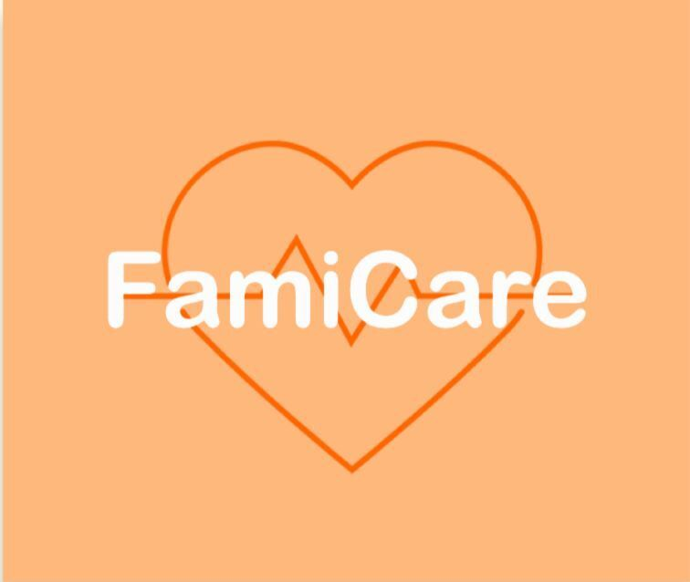
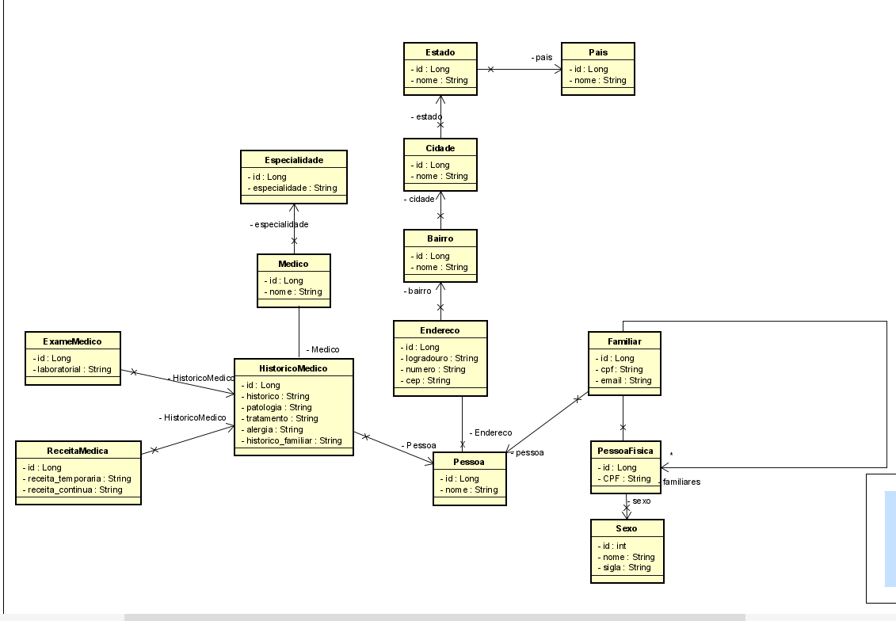
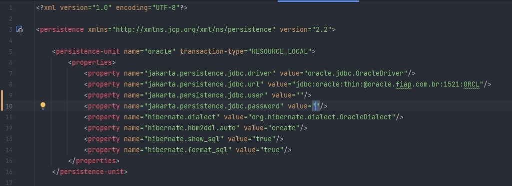
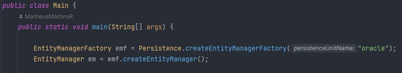

# GLOBAL SOLUTION - 2023 - FamiCare

# Breve apresentação do grupo:
* Matheus Martins da Rocha - RM96505 Turma: 2TDSPT(responsável pela entrega de Enterprise APPLICATION DEVELOPMENT e DataBase Application e Data Science)
* Guilherme Raul Varella - RM97166 Turma: 2TDSPT (responsável pela entrega de DevOps Tools e Cloud Computing)
* Pedro Fontanez Bravo - RM97366 Turma: 2TDSPT (responsável pela entrega de Disruptive Architectures IT, IoB e IA)
* Felipe Rios Miranda - RM96726 Turma 2TDSPT (responsável pela entrega de Compliance e Quality Assurance )]
* Augusto de Carvalho Vertolis Santana - RM96518 Turma 2TDSPT (responsável pela entrega de Hybrid Mobile App Development e Digital Business Enablement)

# PROBLEMA:

O problema que o FamiCare se propõe a solucionar está relacionado à gestão ineficiente e descentralizada das informações médicas das famílias que frequentam os postos de saúde do SUS. Antes da introdução do FamiCare, essas informações eram registradas em papel, o que resultava em dificuldades no armazenamento, acesso e compartilhamento desses dados. A falta de centralização e a dependência de registros físicos dificultavam o acompanhamento médico eficiente, especialmente em situações de emergência ou durante consultas em locais diferentes.

# Solução proposta: 
O FamiCare propõe uma solução abrangente e digital para a gestão de informações médicas, visando simplificar e centralizar o histórico médico de cada família. Ele oferece uma plataforma digital segura na qual as famílias podem cadastrar seus membros e ter acesso instantâneo a consultas, histórico médico, resultados de exames, prescrições e prontuários. A solução elimina a necessidade de carregar cópias físicas para diferentes consultas ou hospitais, proporcionando acessibilidade remota aos dados.

A solução também destaca a interoperabilidade dos dados, integrando-se ao sistema de saúde do SUS. Isso colabora com a infraestrutura existente, garantindo uma transição suave e facilitando o trabalho dos profissionais de saúde. Além disso, o FamiCare permite que os usuários se atualizem regularmente sobre informações médicas, promovendo um acompanhamento mais preciso do estado de saúde de cada membro da família.

# Escopo do projeto de desenvolvimento:
O escopo do projeto de desenvolvimento do FamiCare engloba a criação de um aplicativo mobile robusto e seguro. As funcionalidades incluirão o cadastro de famílias, inclusão de membros, registro e acesso a consultas, histórico médico, resultados de exames, prescrições, prontuários e outras informações relevantes. A prioridade é garantir a acessibilidade remota aos dados, proporcionando disponibilidade em situações de emergência ou durante consultas fora da área de atendimento habitual.

A integração com o sistema de saúde do SUS é essencial, visando a interoperabilidade dos dados e colaborando com a infraestrutura existente. A plataforma será projetada para assegurar segurança e privacidade, em conformidade com os padrões regulatórios relacionados a informações médicas.

O escopo também abrange recursos que permitem aos usuários manterem-se atualizados regularmente sobre informações médicas, facilitando a comunicação com profissionais de saúde e possibilitando tratamentos mais eficazes. O projeto inclui o desenvolvimento de uma interface intuitiva para usuários finais, bem como funcionalidades administrativas para profissionais de saúde e gestores do sistema, tudo isso no ambiente de um aplicativo mobile.

# O que ficará de fora do escopo:

Implementação em Plataformas Não Mobile: Desenvolvimento para plataformas que não sejam exclusivamente mobile, como versões desktop, web ou sistemas operacionais específicos.

# Lista de tecnologias utilizadas e versão: 

- Oracle SQL Developer 21.2.0.187
- Oracle SQL Developer Data Modeler 21.2.0
- IntelliJ 2021.3.2.
- React Native
- Oracle VM VirtualBox
- Astah Student 8.2
- Software Archi 4.10.0
- Google Colab 
- Roboflow

# Diagrama de classe: 

# Modelo Lógico: 

# Modelo Físico: 

# Video Pitch:

-->link<----

# Como rodar a aplicação:

Abra o Projeto no Seu IDE:

* Inicie o seu Ambiente de Desenvolvimento Integrado (IDE) favorito.
  Importe o projeto para o IDE, selecionando a opção de importação ou abertura de projeto, dependendo das funcionalidades do seu IDE.
  Navegue até a Classe Main:

* No seu IDE, vá até a pasta src/main/java/br.com.fiap.
  Dentro dessa pasta, você encontrará a classe principal chamada Main.java. Abra esta classe para explorar o código-fonte.
  Acesse o Arquivo persistence.xml para Configurar o Banco de Dados:

* Vá até a pasta src/main/resources/META-INF.
  Dentro dessa pasta, abra o arquivo persistence.xml para configurar as propriedades de acesso ao banco de dados. Aqui, você pode ajustar o nome de usuário, senha e outras configurações necessárias para o seu banco de dados Oracle.

  Por exemplo:
  
* 

* Dentro da classe Main.java, certifique-se de que a constante PERSISTENCE_UNIT esteja definida corretamente para o nome do seu persistenceUnit.
  Por exemplo
  

# Executar e Testar a Aplicação:

* No arquivo Main.java, você encontrará um método main. Este é o ponto de entrada da aplicação.
  Clique com o botão direito do mouse no arquivo Main.java e escolha a opção "Run" para executar a aplicação. Alternativamente, procure na parte superior da tela um ícone de "play" para iniciar a execução.
  Esses passos devem ajudar a executar e testar a aplicação localmente em seu ambiente de desenvolvimento. Certifique-se de que o banco dados está disponível e que as configurações do persistence.xml estejam corretas.